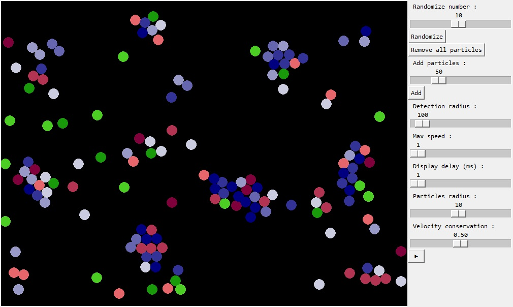

# Python-Particles-Simulation

This is a cellular automaton that simulates different types of particles that are either repelled or attracted to each other type of particle.
## Features
- Visual result of the simulation
- Possibility to randomize several number of particle types
## Installation
1. Download the repository by clicking on `Code > Download ZIP`
2. Extract the ZIP file
3. Run `main.pyw`
## Requirements
- Python 3.7
- Python `tkinter` library
- Python `math` library
- Python `random` library
## Usage
First of all you have to randomize a certain number of particle types using the first option then add the number of particles you want and finally click on the play button.